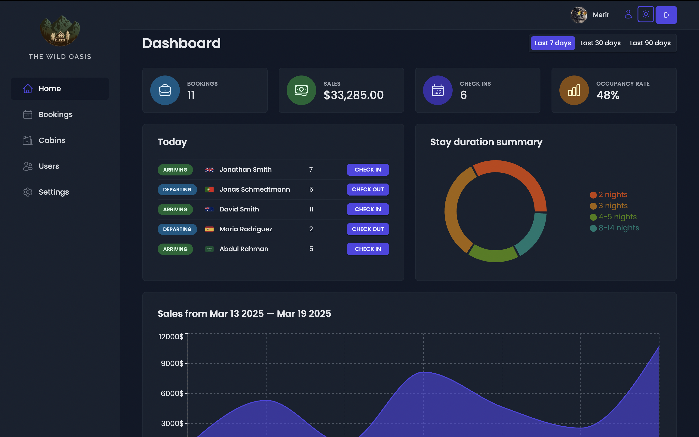
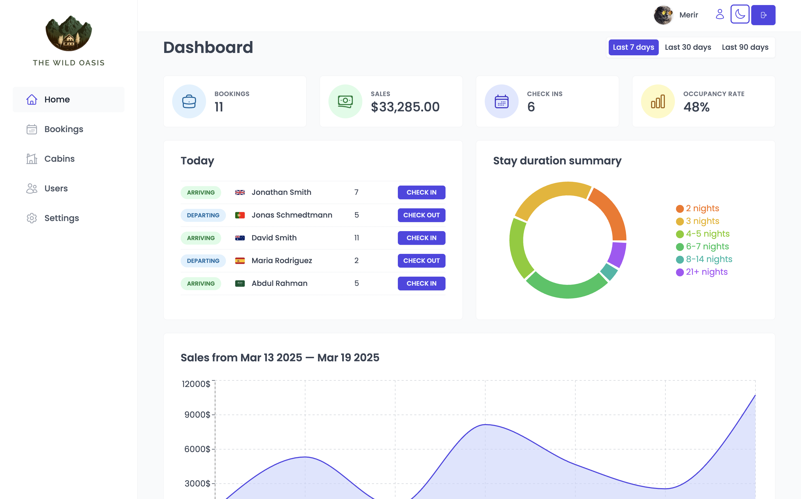
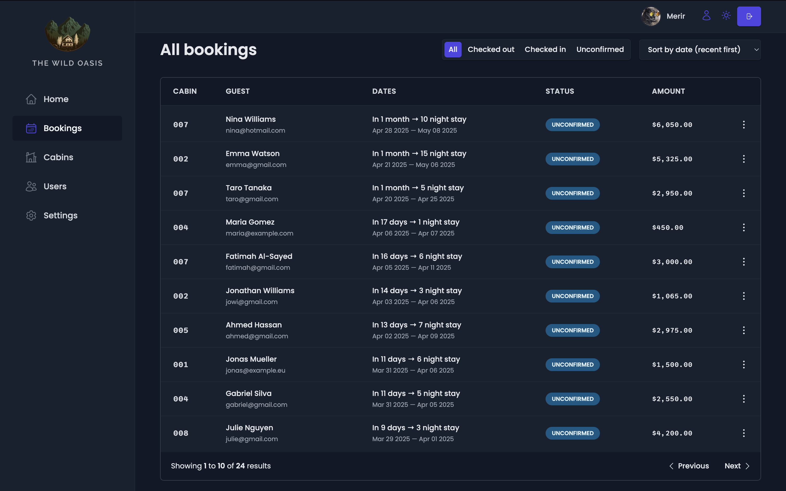
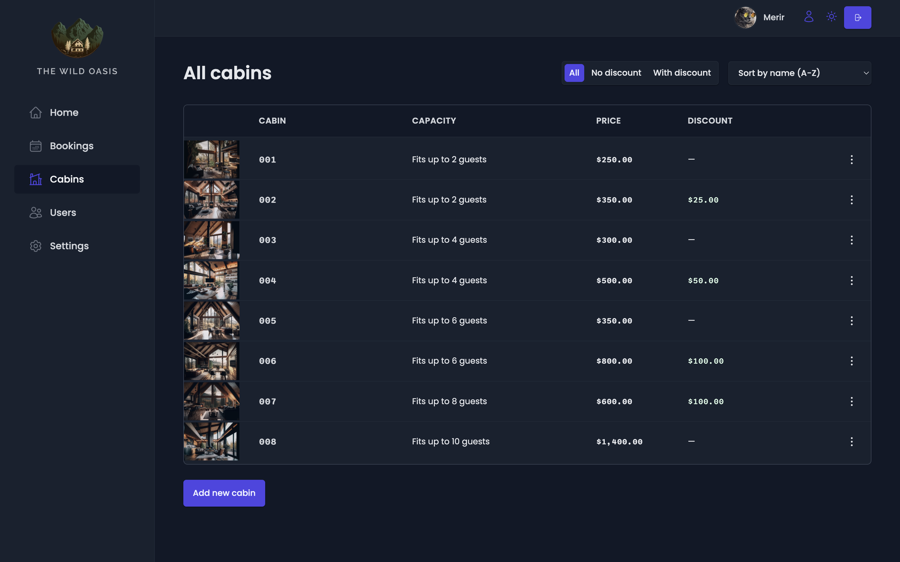

# 🌴 The Wild Oasis — Hotel Booking Dashboard

<p>The Wild Oasis is a full-featured hotel admin dashboard application where staff can manage bookings, guests, cabins, and settings.</p>

<p align="center">
  
  
</p>
<p align="center">
  
  
</p>

## ✨ Features

- **Authentication**:
  Login/Logout with Supabase

- **Dashboard overview**:
  KPIs and charts

- **Manage bookings, guests, and cabins**

- **Upload images with Supabase Storage**

- **Filter, sort, and search data**

- **Responsive and user-friendly UI**

- **Form validation and error handling**

 


## 🛠️ Tech Stack

### **Frontend**

- **React.js**  
- **React Query**  
- **React Router**  
- **Styled Components**  
- **Toast notifications (react-hot-toast)**  
- **Form validation with react-hook-form and zod**  
 
### **Backend**

- **Supabase**: 
  Used as a backend-as-a-service: database + auth + storage

## 🚀 Installation and Setup

#### Step 1: Clone the Repository
Clone the project to your local machine using the following command:

```bash
git clone https://github.com/oxanamar/The-Wild-Oasis.git
cd The-Wild-Oasis
```

#### Step 2: Install dependencies
Navigate to the project directory and install all necessary dependencies:

```bash
npm install
```

#### Step 3: Start the development server
Run the following command to start the application locally:

```bash
npm run dev
```

#### Step 4: Configure Environment Variables
Create a .env file in the root of the project and add your Supabase credentials:

```bash
VITE_SUPABASE_URL=your_supabase_url
VITE_SUPABASE_KEY=your_anon_public_key
```

#### Step 5: Go to http://localhost:5173 and explore The Wild Oasis dashboard! 🏨
